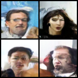

# CLIP-Conditioned DDPM (Text-to-Face)

A ground-up PyTorch implementation of a Text-to-Image Denoising Diffusion Probabilistic Model (DDPM). This repository trains a custom U-Net to generate human faces based on text descriptions, utilizing OpenAI's frozen CLIP model for text-conditioning and the CelebA dataset for training ground truth.


*Samples generated using DDPM sampling (T=1000) conditioned on varying text prompts.*

## Architecture Overview

* **Forward Process:** Linear variance schedule ($T=1000$).
* **Reverse Process:** Custom U-Net with skip connections and GroupNorm.
* **Conditioning:** * **Time:** Sinusoidal positional embeddings.
    * **Text:** `openai/clip-vit-base-patch32` (Frozen text encoder). Text embeddings are linearly projected and fused with time embeddings in the U-Net bottleneck and up/down sampling blocks.
* **Dataset:** CelebA. The 40 binary attributes were mapped to natural language strings on-the-fly via a custom PyTorch `Dataset` pipeline.

## Prerequisites

This repository relies on **Git LFS (Large File Storage)** to handle the `.pt` model weights. You must have it installed before cloning.

```bash
# Debian/Ubuntu
sudo apt install git-lfs

# Arch Linux
sudo pacman -S git-lfs

# Initialize LFS after cloning
git lfs install
```

## Dependencies
```Bash
pip install torch torchvision transformers pandas pillow tqdm
```

# Data Preparation

1. Download the CelebA Dataset.

2. Place the aligned images in a directory named img_align_celeba/ in the project root.

3. Place list_attr_celeba.csv in the project root.

# Usage
## Training

To train the model from scratch (requires a CUDA-capable GPU for reasonable completion times):
```Bash
python train.py
```

- Note: Checkpoints are saved automatically to the checkpoints/ directory after each epoch.

## Inference (Sampling)

To generate images using a trained checkpoint, modify the prompt in sample.py and run:

```Bash
python sample.py
```

This utilizes the standard DDPM reverse loop. It starts with random Gaussian noise and iteratively denoises it over 1000 steps conditioned on the provided text prompt.

# Project Structure

1. dataset.py: CelebA loading, normalization ([-1, 1]), and text prompt synthesis.
1. diffusion.py: Forward noise injection and schedule mathematics.
1. unet.py: Core neural network, time embeddings, and text-fusion logic.
1. text_encoder.py: HuggingFace wrapper for the frozen CLIP text encoder.
1. train.py: End-to-end MSE training loop.
1. sample.py: DDPM inference and image generation.


# Sample 


```py
prompts = [
        "A photo of a person face with Smiling, Eyeglasses, Male",
        "A photo of a person face with Bangs, No Beard, Young, Female",
        "A photo of a person face with Black Hair, Heavy Makeup",
        "A photo of a person face with Goatee, Bushy Eyebrows, Male"
    ]
```

*Samples generated using DDPM sampling (T=1000) conditioned on varying text prompts.*